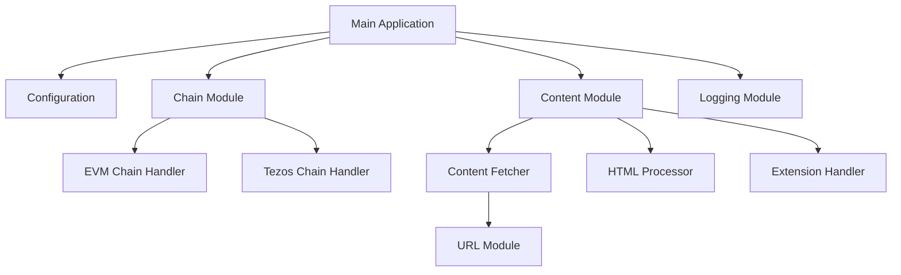
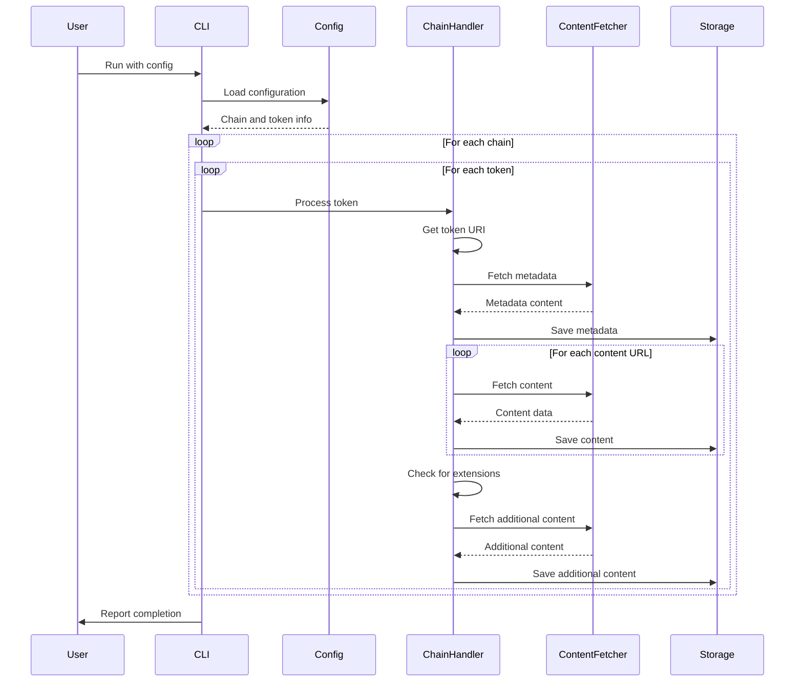

# System Patterns: nftbk

## Architecture Overview

nftbk follows a modular architecture organized around key responsibilities:



## Core Design Patterns

### 1. Chain Abstraction

The system uses a modular approach to handle different blockchain networks:

- **Chain Module Interface**: Common patterns for interacting with blockchains
- **Chain-Specific Implementations**: Specialized modules for EVM chains and Tezos
- **Extensibility**: Architecture allows for adding new chain implementations

This pattern enables the system to support multiple blockchains while maintaining a consistent interface for the main application.

### 2. Content Processing Pipeline

Content is processed through a pipeline that handles different types of data:

1. **Metadata Retrieval**: Fetch NFT metadata from blockchain or IPFS
2. **Content Extraction**: Parse metadata to identify content URLs
3. **Content Fetching**: Download identified content
4. **Format Detection**: Identify content types (images, videos, HTML, etc.)
5. **Special Processing**: Apply format-specific handling (e.g., HTML resource extraction)
6. **Storage**: Save content with appropriate file extensions and organization

This pipeline approach allows for specialized handling of different content types while maintaining a consistent overall flow.

### 3. URL Resolution and Normalization

The system handles various URL formats and protocols:

- **IPFS Gateway Resolution**: Convert ipfs:// URLs to HTTP gateway URLs
- **Data URL Handling**: Extract and decode base64 content from data URLs
- **Path Extraction**: Parse URLs to extract meaningful filenames

This pattern ensures consistent handling of the diverse URL formats found in NFT metadata.

### 4. Error Handling and Retry Logic

The system implements robust error handling:

- **Graceful Degradation**: Continue processing other tokens when one fails
- **Retry Mechanism**: Implement backoff for rate-limited API calls
- **Detailed Logging**: Provide context-rich error information

This approach ensures the system can handle real-world network and API limitations.

### 5. Extension Mechanism

The system includes a pattern for handling special cases:

- **Contract-Specific Extensions**: Custom handling for specific NFT contracts
- **Pluggable Architecture**: Extensions can be added without modifying core logic

This allows for handling unique NFT implementations that require special processing.

## Data Flow



## Directory Structure

The codebase follows a modular organization:

```
src/
  ├── main.rs           # Entry point and CLI handling
  ├── logging.rs        # Logging configuration
  ├── chain/            # Chain-specific implementations
  │   ├── mod.rs        # Chain module exports
  │   ├── evm.rs        # Ethereum-based chain handling
  │   └── tezos.rs      # Tezos chain handling
  ├── content/          # Content processing
  │   ├── mod.rs        # Content fetching and saving
  │   ├── extensions.rs # Special case handling
  │   └── html.rs       # HTML resource processing
  └── url/              # URL handling utilities
      └── mod.rs        # URL normalization and parsing
```

## Key Technical Decisions

1. **Async Runtime**: Using Tokio for asynchronous operations to handle concurrent downloads efficiently.

2. **Chain-Specific Libraries**: Using specialized libraries for each blockchain (alloy for EVM chains, tezos-* crates for Tezos).

3. **Content Type Detection**: Using binary pattern matching to detect file types rather than relying solely on extensions or MIME types.

4. **Configuration Format**: Using TOML for human-readable and easily editable configuration.

5. **Structured Logging**: Using tracing for flexible and contextual logging.
